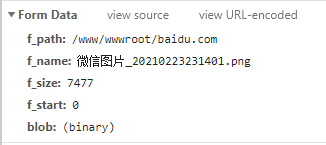

本文记录一次使用 **Python3 + requests** 调用 **宝塔面板文件上传接口** 的实际过程，适合用于自动化部署、文件同步、远程上传等场景。

---

## 宝塔上传接口说明

宝塔面板提供了文件管理相关接口，可以通过 **POST 请求** 将文件上传到指定目录。
宝塔上传chrome截图：


### Request URL 示例

> /files?action=upload

````python
## 定义主要函数
def PingBaoTa(ip, port):  # 拼接链接
    return "http://" + ip + ":" + port

def GetMd5(s):  # 参考了Demo.py
    m = md5()
    m.update(s.encode("utf-8"))
    return m.hexdigest()

def GetKeyData(apikey):  # 签名算法
    now_time = time()
    p_data = {
        "request_token": GetMd5(str(now_time) + "" + GetMd5(apikey)),
        "request_time": now_time
    }
    return p_data

def GetSitePath(btpanel, btkey, site):   # 获取指定站点目录 若站点不存在则返回-1
    data = Websites(btpanel, btkey)["data"]
    for i in data:
        if i["name"] == site:
            return i["path"]
    return -1


def WebUpload(btpanel, btkey, site, file_name):    #上传文件
    """
    btpanel                面板地址
    btkey                  API密匙
    site                   设置上传文件的站点
    file_name              上传文件
    """
    headers = {
    'User-Agent': 'Mozilla/5.0 (Windows NT 10.0; Win64; x64; rv:89.0) Gecko/20100101 Firefox/89.0',
    #'Content-Type': 'application/octet-stream',	#这里这个参数一定不要给，否则会失败
    }
    url = btpanel + config["WebUpload"]		# config["WebUpload"]为post请求地址
    data = GetKeyData(btkey)
    f_path = GetSitePath(btpanel, btkey, site)
    file_name.replace('\\', '/')
    file = file_name.split('/')[-1]
    file_tup = {
        #file: ( 'blob', open(file_name, 'rb'), 'application/octet-stream'),	#用这个上传文件时会创建一个临时文件名，但是文件内并无任何内容，去宝塔论坛上看到也有和我一样的只有一个文件名的情况，所以我们把post请求种的每一项拆分开的到如下：
        'blob': open(file_name, 'rb'),
        "filename" :"blob",
        "Content-Type": "application/octet-stream",
        "Content-Disposition": "form-data"
    }
    data['f_path'] = f_path
    data['f_name'] = file
    data['f_size'] = str(os.path.getsize(file_name))
    data['f_start'] = '0'
    res = requests.post(url,files=file_tup, data = data, headers = headers)
    resp = res.content.decode()
    return resp

if __name__ == "__main__":
    _ApiKey = "**********"  #宝塔api key在宝塔后台 面板设置>api接口>接口密钥 获得
    _BtPanel = "0.0.0.0"	#面板ip
    _Port = "12345"		#面板端口
    _Url = PingBaoTa(_BtPanel, _Port)
    print (WebUpload(_Url, _ApiKey, "baidu.com", "./wordpress/wordpress.zip"))	#要将文件./wordpress/wordpress.zip上传到宝塔后台baidu.com的站点并打印出返回结果
````

输出结果为：

> {"status": true, "msg": "上传成功!"}

