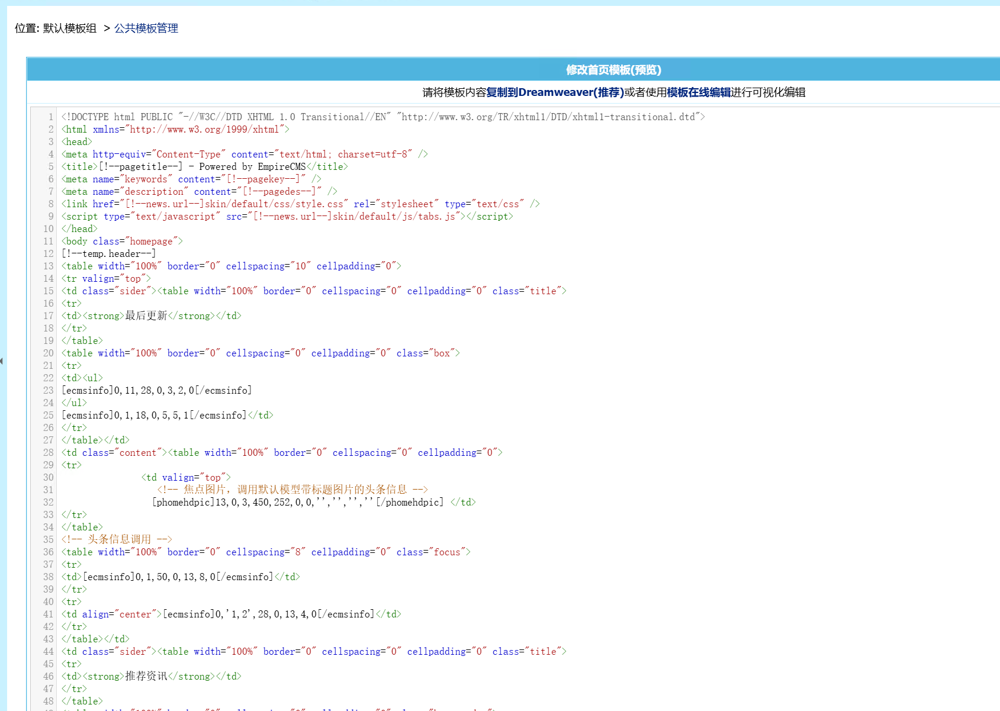

不知到大家写帝国cms模板都是怎么弄的，原来的textarea真是种折磨，今天把他改掉。
我这里用的是CodeMirror，当然你也可以使用其他


首页模板文件：/eadmin/admin/template/EditPublicTemp.php
找到

````html
<textarea name="temptext" cols="110" rows="27" id="temptext" wrap="OFF" style="WIDTH: 100%">
  <?=ehtmlspecialchars(stripSlashes($r['indextemp']))?>
</textarea>
````

改成

````html
<!-- CodeMirror 样式和脚本 -->
<link rel="stylesheet" href="https://cdnjs.cloudflare.com/ajax/libs/codemirror/5.65.16/codemirror.min.css">
<script src="https://cdnjs.cloudflare.com/ajax/libs/codemirror/5.65.16/codemirror.min.js"></script>
<!-- 你可以根据实际语言引入对应语法支持 -->
<script src="https://cdnjs.cloudflare.com/ajax/libs/codemirror/5.65.16/mode/htmlmixed/htmlmixed.min.js"></script>
<script src="https://cdnjs.cloudflare.com/ajax/libs/codemirror/5.65.16/mode/xml/xml.min.js"></script>
<script src="https://cdnjs.cloudflare.com/ajax/libs/codemirror/5.65.16/mode/javascript/javascript.min.js"></script>
<script src="https://cdnjs.cloudflare.com/ajax/libs/codemirror/5.65.16/mode/css/css.min.js"></script>

<!-- textarea 仍保留，用于表单提交 -->
<textarea name="temptext" id="temptext" style="display: none;">
  <?=ehtmlspecialchars(stripSlashes($r['indextemp']))?>
</textarea>

<!-- 编辑器容器 -->
<div id="editor-wrapper" style="width: 100%; border: 1px solid #ccc;">
  <textarea id="editor"><?=ehtmlspecialchars(stripSlashes($r['indextemp']))?></textarea>
</div>

<style>
  /* 强制 CodeMirror 左对齐 */
  .CodeMirror {
    height: 800px; 
    text-align: left !important;
  }
</style>
<script>
  var editor = CodeMirror.fromTextArea(document.getElementById("editor"), {
    mode: "htmlmixed",
    lineNumbers: true,
    lineWrapping: true,
    theme: "default", // 可选其他主题，如 monokai、darcula 等
  });

  // 表单提交时，把编辑器内容写回隐藏域
  document.querySelector('form').addEventListener('submit', function () {
    document.getElementById('temptext').value = editor.getValue();
  });
</script>
````

