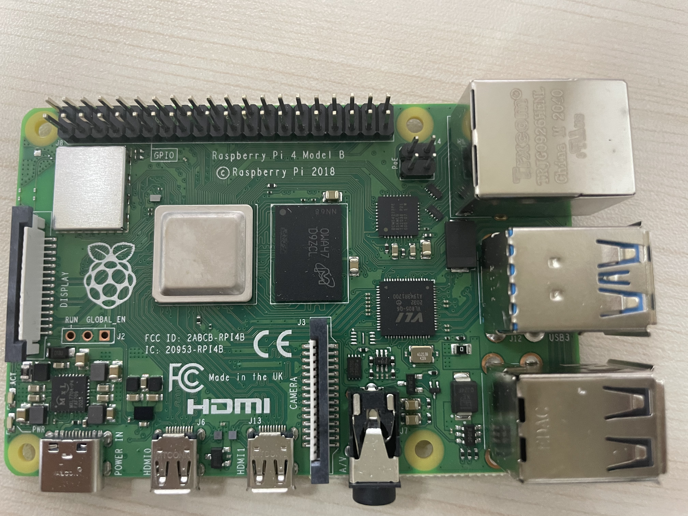
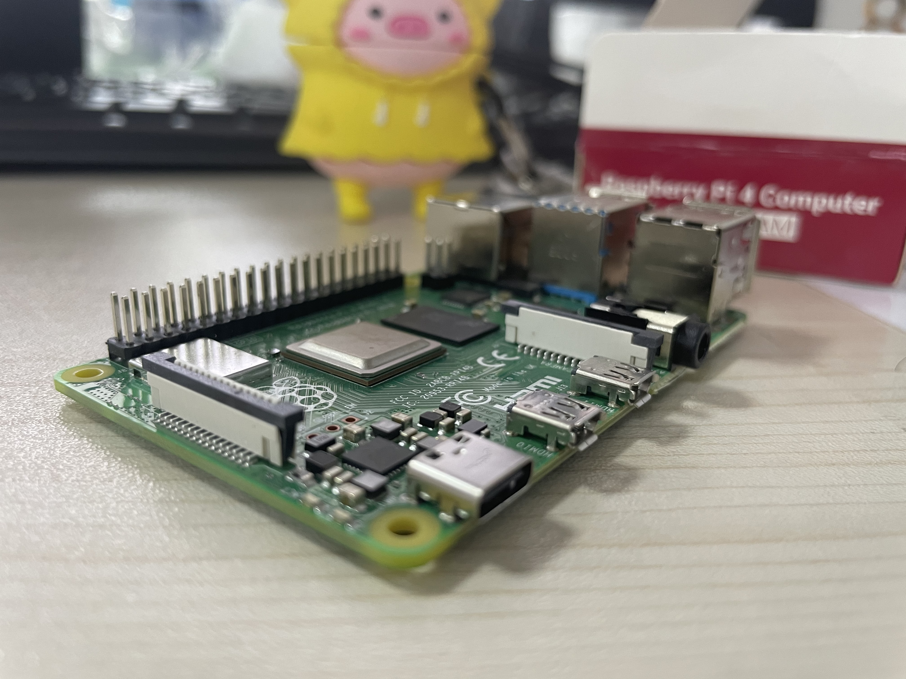
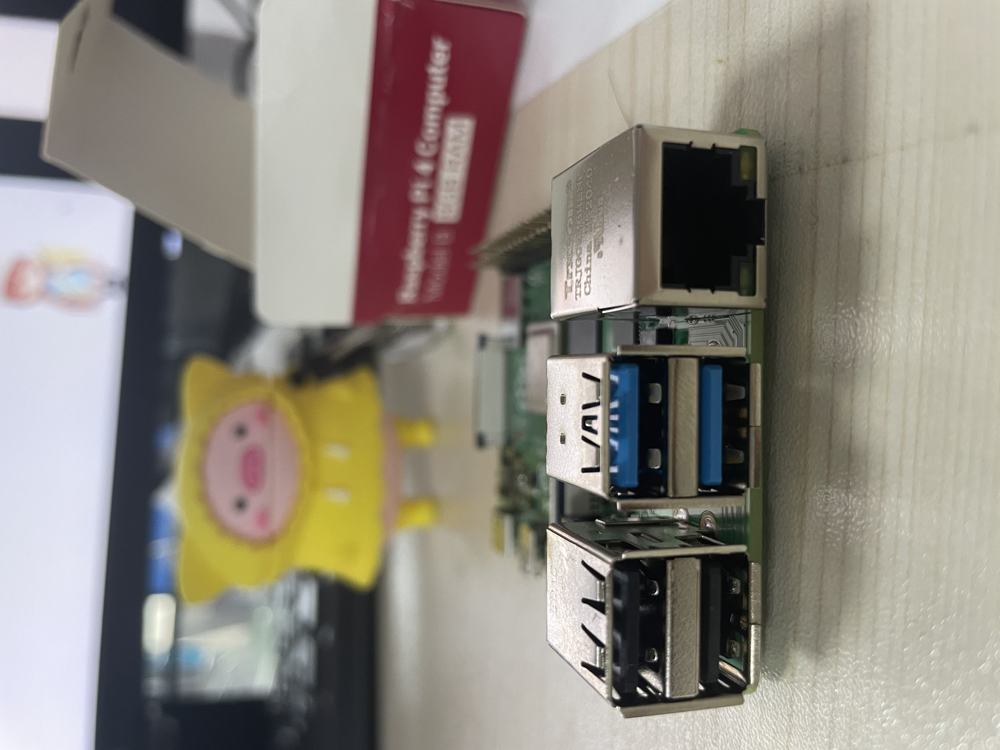

很久之前大概在树莓派2发布的时候，就开始关注这个产品，始终没有下定决心，玩不好就浪费了，今天总算拿到了我的第一台Raspberry Pi 4B 8G，拿到手之后不知道做什么了，哈

## 为什么打算入手Raspberry Pi？

1. 想有一台自己的电脑，回家后可以看看视频，写博客，写点自己小东西，游戏吗？现在很少有时间玩哈哈，之前喜欢打CSGO，现在有时间会打一把手机游戏，mobile legends，或者闲暇时会打开switch，旷野之息骑马跑两圈。
2. 由于最近在研究一个小脚本，需要需要不定时换ip，但是我办公的电脑经常换ip终端其他的任务。虚拟机？配置不太够用了，办公电脑win10系统，开了一个kali双核4G，和windows7虚拟机双核4G，浏览器经常需要打开多个标签，总会提示内存不足。
3. 想了好久了，有看网上有很多玩法，就想试试，如果第一个能玩明白，之后会入手更多

## 显摆一下

我卖的不算便宜lazada上P4549.75，

他们说着包装环保，纸壳，8GB 嘿嘿（估计是用不上，浪费了，奢侈一回 DX；偷笑;）

看看都是有什么

主板正面：

配置我就不在这里多说了，想了解更多参数，请查看https://www.josejang.com/raspberry-pi/210.html

从左到右电源，

sd卡槽在后面

