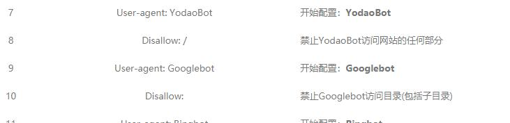

### robots.txt究竟怎样写才是对的？

我在[站长工具](http://tool.chinaz.com/robots/)http://tool.chinaz.com/robots/ 生成的文件分别点击了允许和拒绝一些搜索引擎，生成的结果如下

User-agent: Baiduspider
Disallow: /
User-agent: Sosospider
Disallow: /
User-agent: sogou spider
Disallow: /
User-agent: YodaoBot
Disallow: /
User-agent: Googlebot
Disallow:
User-agent: Bingbot
Disallow:
User-agent: Slurp
Disallow:
User-agent: Teoma
Disallow:
User-agent: ia_archiver
Disallow:
User-agent: twiceler
Disallow:
User-agent: MSNBot
Disallow:
User-agent: Scrubby
Disallow:
User-agent: Robozilla
Disallow:
User-agent: Gigabot
Disallow:
User-agent: googlebot-image
Disallow:
User-agent: googlebot-mobile
Disallow:
User-agent: yahoo-mmcrawler
Disallow:
User-agent: yahoo-blogs/v3.9
Disallow:
User-agent: psbot
Disallow:
User-agent: *
Disallow:
Sitemap: https://www.josejang.com/sitemap_index.xml

很明显，这个是禁止百度索引
User-agent: Baiduspider
Disallow: /
这个却是允许Google索引
User-agent: Googlebot
Disallow:
不知道大家又没有发现他们的区别，仅仅是多了一个“/”上划线
真是奇怪，允许索引不是用Allow: 吗？

Disallow记录为空说明该网站的所有页面都允许被搜索引擎抓取，在"/robots.txt"文件中，至少要有一条Disallow记录。如果"/robots.txt"是一个空文件，则对于所有的搜索引擎蜘蛛，该网站都是开放的可以被抓取的。

然后我在站长工具http://s.tool.chinaz.com/robots 中进行检测：
结果是全部不允许索引....

