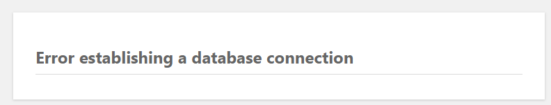
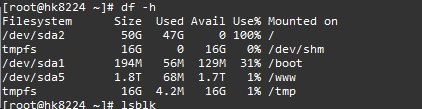

最近服务器不知道怎么搞得，通过22安装出错，/root/tools/wp_uninstal*.sh卸载，重新安装提示

> Error establishing a database connection

于是我用安装时得到的数据库账号密码登录

````
mysql -u wpdb20196u25322 -p
Enter password:
Welcome to the MariaDB monitor.  Commands end with ; or \g.
Your MariaDB connection id is 20173
Server version: 10.0.38-MariaDB MariaDB Server
Copyright (c) 2000, 2018, Oracle, MariaDB Corporation Ab and others.
Type 'help;' or '\h' for help. Type '\c' to clear the current input statement.
MariaDB [(none)]> show databases;
+--------------------+
| Database           |
+--------------------+
| information_schema |
| wp30944db_20196    |
+--------------------+
2 rows in set (0.01 sec)
MariaDB [(none)]> quit;
````

对的账号密码可用，并且数据库确实存在
然后查看wp-config.php文件中的是否一致，发现结果并不相同，改好后重新访问网站：

继续


靠原来是磁盘空间不足导致的


df -h

查看磁盘占用情况，果然

mv -f /home /www/

ln –s

就可以解决

但是我直接联系了服务器商，得到的答案是从装系统进行分区

于是我就悲剧了

