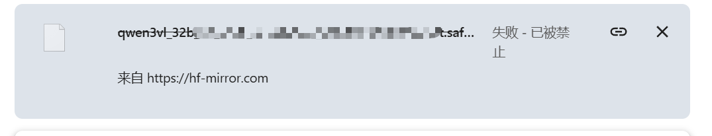

在浏览器下在模型时候，就快下载完成了，然后突然 “失败 - 已被禁止” 



## 先安装 huggingface_hub

PowerShell执行

>pip install -U huggingface_hub

## 使用脚本下载

创建文件 download.py
### 下载整个模型仓库
这里以Qwen/Qwen3.8-27B为例子：

```python
from huggingface_hub import snapshot_download
import os

# 设置国内镜像环境变量
os.environ["HF_ENDPOINT"] = "https://hf-mirror.com"

# 定义你自己管理的模型存放路径（建议放在你项目可控的目录下）
my_model_path = r"D:\MyModels\Qwen3.8-27B"

# 下载整个仓库（会自动跳过已下载的部分，实现断点续传）
snapshot_download(
    repo_id="Qwen/Qwen3.8-27B",  # 对应页面上的作者/模型名
    local_dir=my_model_path,
    local_dir_use_symlinks=False,
    # 如果只想下载 safetensors 和 json/txt 配置文件，可以加过滤（不需要可删掉下面这行）
    allow_patterns=["*.safetensors", "*.json", "*.txt", "*.jinja"]
)
```
### 下载单个大文件
如果是下载单个文件

```python
from huggingface_hub import hf_hub_download
import os

os.environ["HF_ENDPOINT"] = "https://hf-mirror.com"

# 定义你自己管理的模型存放路径（建议放在你项目可控的目录下）
my_model_path = r"D:\MyModels\Qwen3.8-27B-GGUF"

hf_hub_download(
    repo_id="unsloth/Qwen3.8-27B-GGUF",
    filename="Qwen3.8-27B-UD-Q8_K_XL.gguf",
    local_dir=my_model_path,
    local_dir_use_symlinks=False    # 关键：确保下载的是真实文件，而不是符号链接
)
```


它在下载时会先下载一个临时文件，并且会自动检测本地已有的部分文件大小。如果中途下载中断或手动停止，再次运行该 Python 脚本时，它会自动从断点处继续下载，不会从头开始。