> 💡 **摘要**：利用 Kaggle 提供的免费双卡 NVIDIA T4 算力与 Ngrok 的内网穿透能力，只需简单的几步配置，即可零成本部署并导出标准的 OpenAI API 接口，供第三方客户端随时调用。

---

## 前置准备

在开始导入 Notebook 之前，我们需要先准备好穿透工具与算力平台的账号配置。

### 1. 获取 Ngrok Authtoken

1. 登录 [Ngrok Dashboard](https://dashboard.ngrok.com/)。
2. 导航至 **Gateway** 选项卡（⚠️ *注意：不要选择 AI Gateway*）。
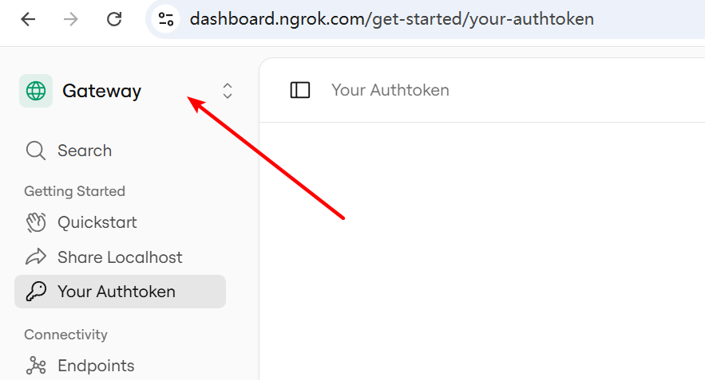
3. 在侧边栏进入 **Your Authtoken**，复制并保存好你的身份令牌，后面会用到。
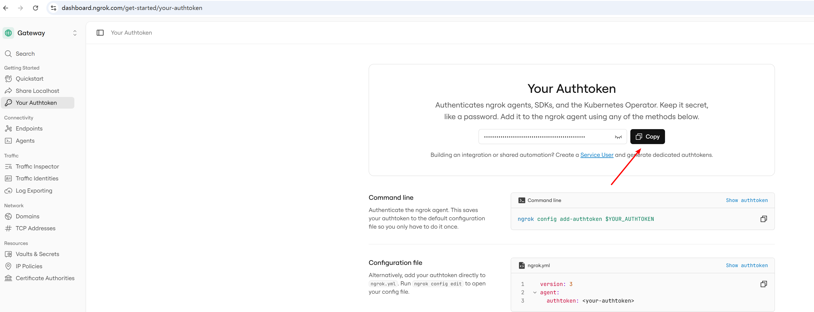
### 2. 激活 Kaggle 免费 GPU 配额

1. 登录 [Kaggle](https://www.kaggle.com/)。
2. 进入个人中心 `Settings` 找到 `Phone verification`。

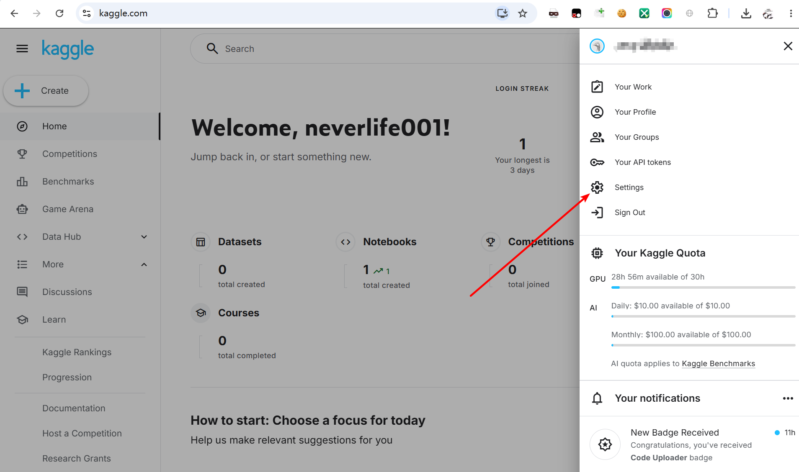
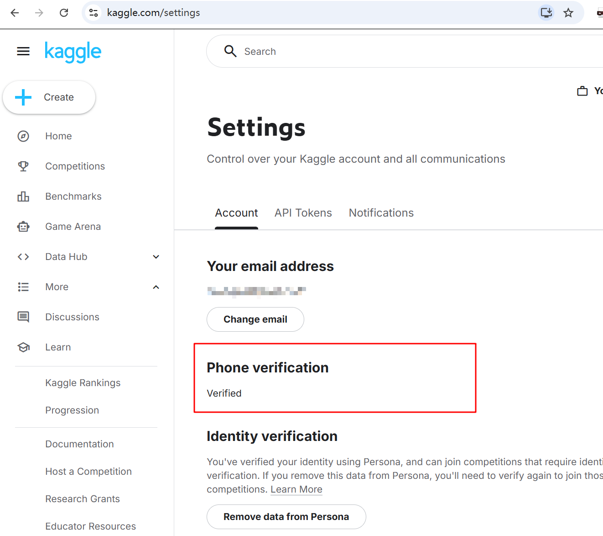
3. 输入手机号完成短信验证（支持中国大陆 `+86` 号码）。


> 🎁 **配额说明**：完成手机验证后，Kaggle 每周将自动发放 **30 小时** 的免费 GPU 算力资源（按开机使用时长扣除，关机即停止计时）。


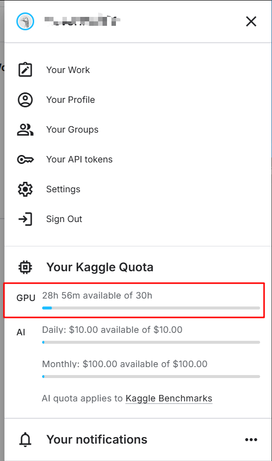

---

## 部署与配置步骤

### Step 1. 导入项目 Notebook

1. 在 Kaggle 顶部导航选择 **Your Work**，点击 **Create** -> **Import Notebook**。
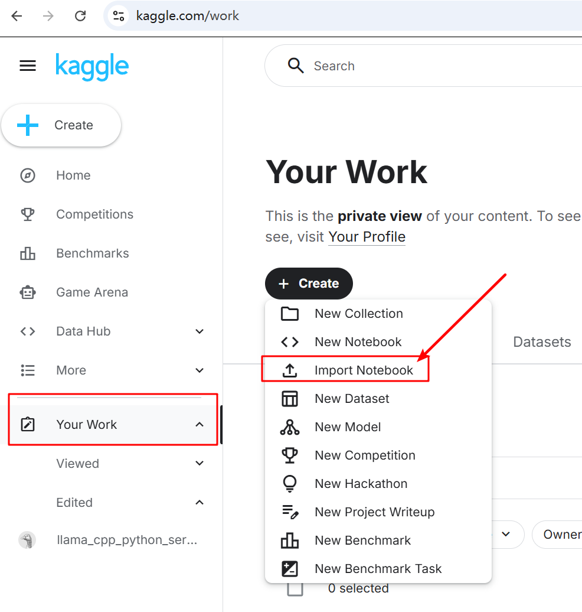
2. 上传文件 [llama-cpp-python-server.ipynb](https://url89.ctfile.com/f/63049189-17569901134726-a1327b?p=9487)(下载访问密码: 9487)
3. 将 **Advanced Settings** 设为 `Quick Save`，点击右下角 **Import**。
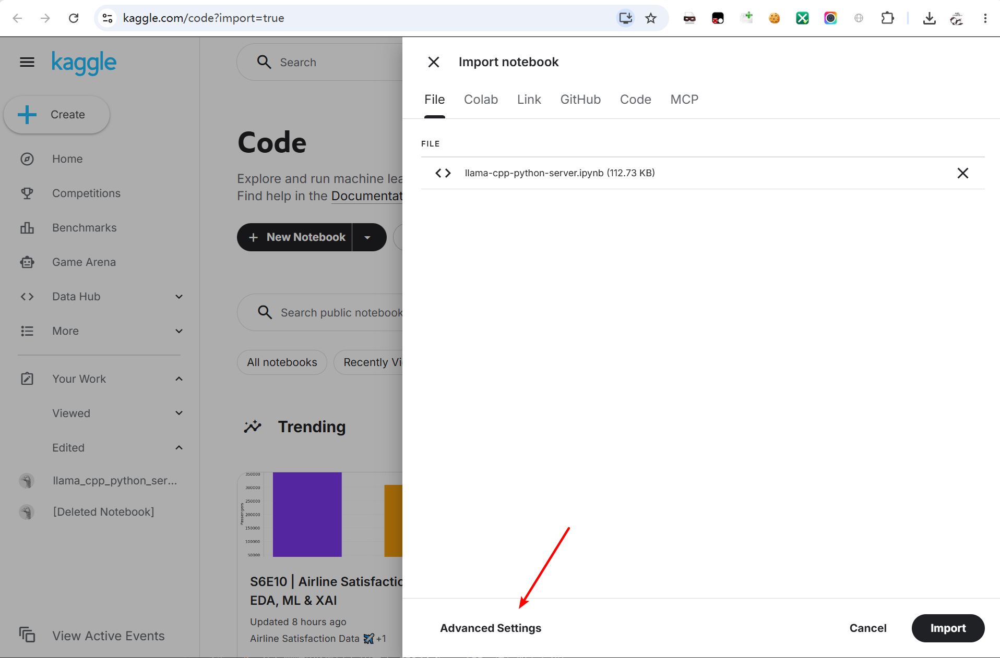
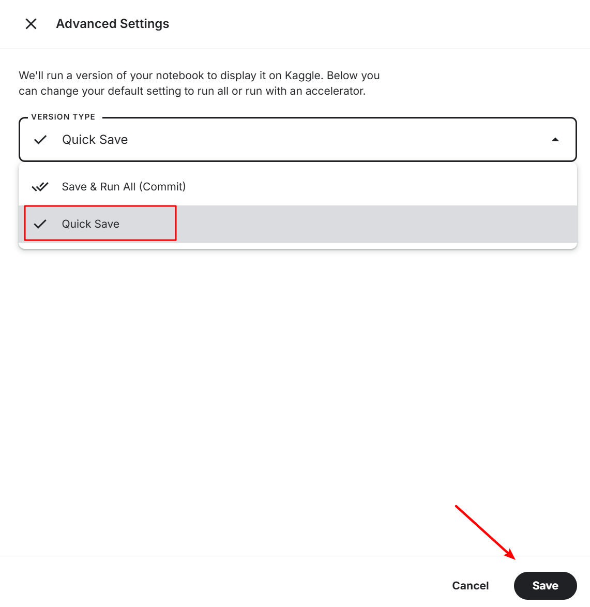

4. 页面载入完成后，点击右上角 **Edit** 进入代码编save辑器。
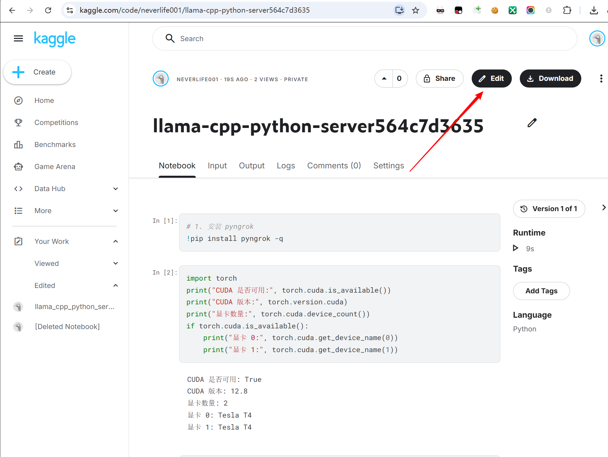
### Step 2. 开启硬件加速（GPU）

1. 在编辑器顶部菜单栏依次点击GPU：`Settings` -> `Accelerator` -> `GPU T4 x2`。
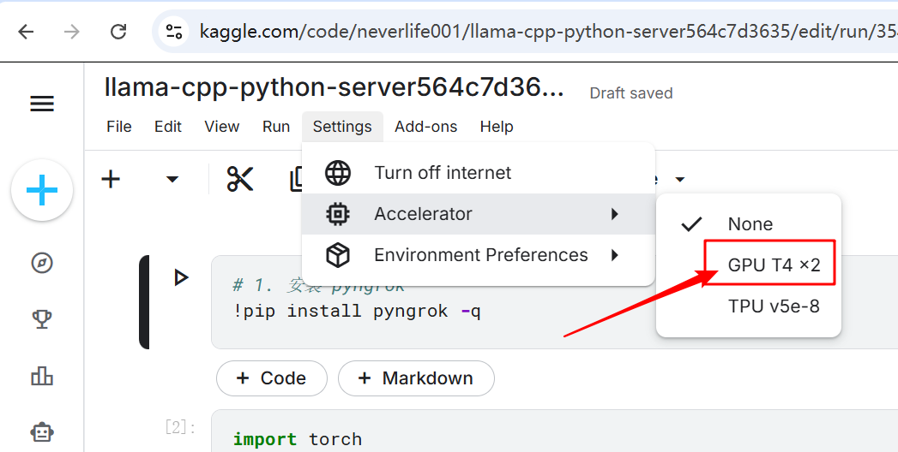

2. 在弹出的二次确认弹窗中，选择 **Turn on GPU T4 x2** 激活双卡环境。
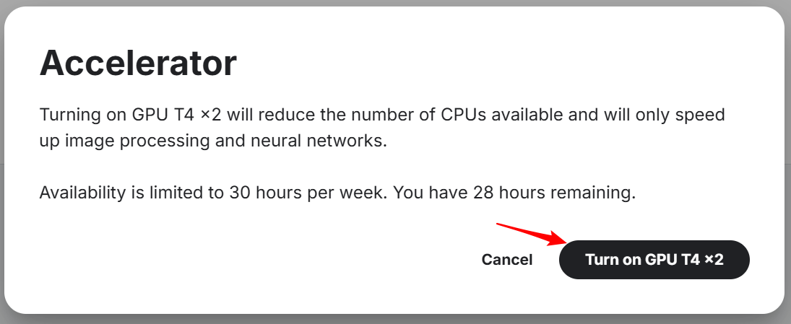

### Step 3. 绑定 Ngrok 环境变量

为了安全地在代码中调用 token 且不泄露到公网：

1. 点击顶部菜单栏的 `Add-ons` -> `Secrets`。
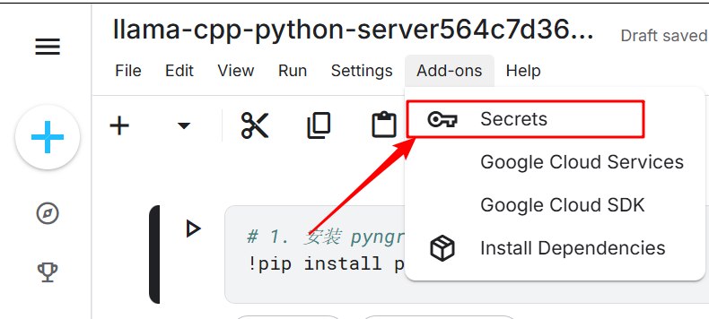

2. 在右侧弹出的配置栏最下面点击 **Add Secret**，填写如下参数：
   - **Label**: `NGROK_TOKEN`   （这里一定要和我这个一样）
   - **Value**: `[你刚才复制的 Ngrok Authtoken]`
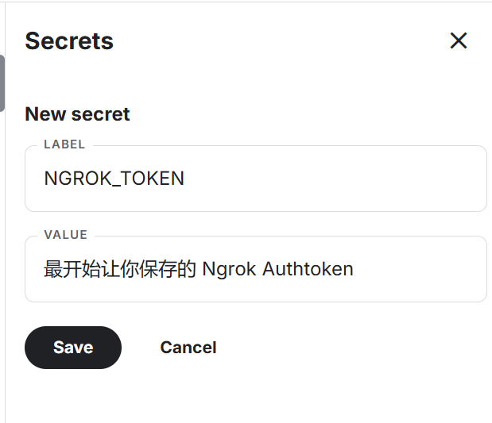
3. 点击 **Save** 完成环境变量保存。

---

## 运行与 API 调用

1. 点击快捷工具栏中的 **Run all**（运行所有单元格）。
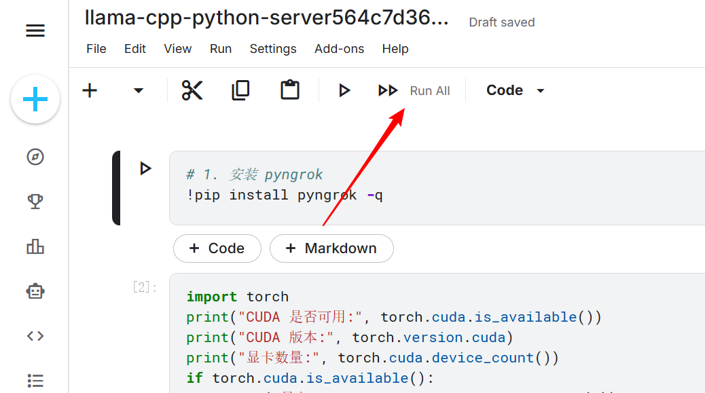
2. 等待环境构建及模型载入（通常需要等几分钟）。
3. 模型成功运行后，滚动条拉到最下面，最底部将输出生成的公网 URL
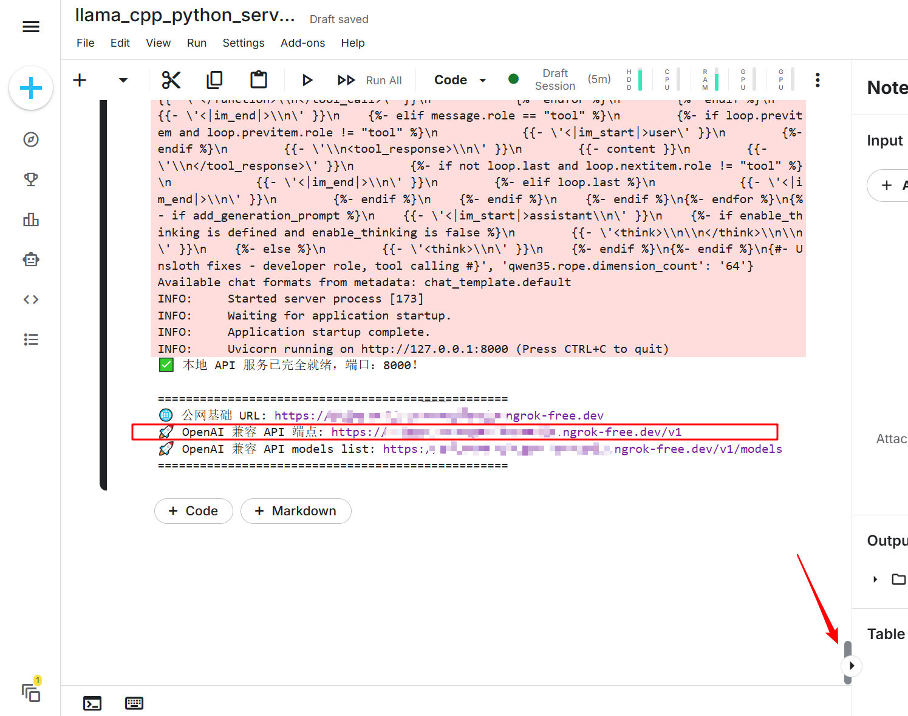
```bash
# 控制台输出示例
🚀 OpenAI 兼容 API 端点: https://xxxx-xx-xx-xxx-xx.ngrok-free.app/v1
```


4. 复制该 URL 地址，直接填入 ChatBox、NextChat 等客户端的 API Base URL 中即可开始对话。

---

## 算力省流建议

- **即用即关**：使用完毕后，务必点击页面上方的 **电源图标（Stop Session）** 终止虚拟机运行，避免无谓消耗每周的免费时长。
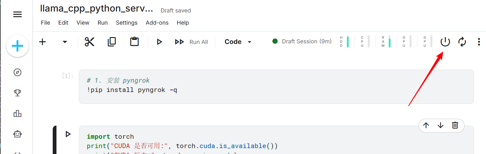
- **环境持久化**：如需更换大模型或修改加载参数，直接调整 Notebook 中的 `llama-cpp-python` 启动命令即可。

在这里更换模型：
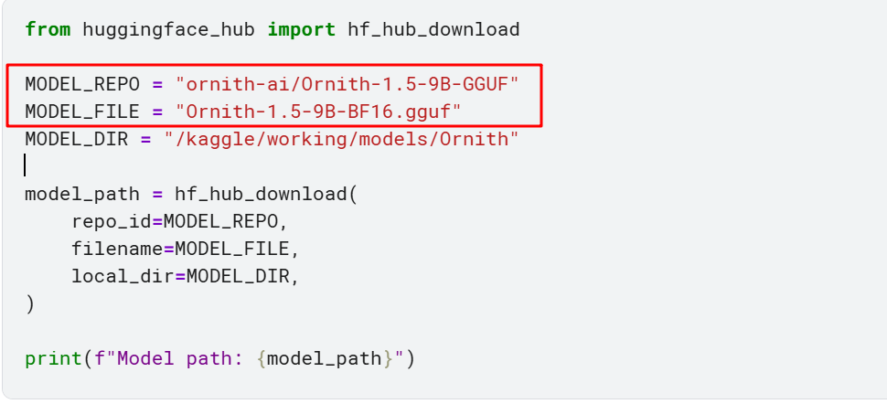


## 外部客户端调用示例（Python SDK）

```python
from openai import OpenAI

# 初始化客户端
client = OpenAI(
    base_url="https://xxx-xx-xx-xxx.ngrok-free.app/v1",  # 替换为你的 Ngrok 公网地址
    api_key="not-needed",  # llama-cpp-python 默认无需验证 key
    default_headers={
        # ⚠️ 关键设置：绕过 Ngrok 免费版的浏览器首次访问拦截警告页
        "ngrok-skip-browser-warning": "true"  
    }
)

# 发起对话请求
response = client.chat.completions.create(
    model="Ornith-1.5-9B-BF16",  # 填入你部署的模型名称
    messages=[
        {"role": "user", "content": "hello world!"}
    ]
)

# 打印模型回复内容
print(response.choices[0].message.content)

```

