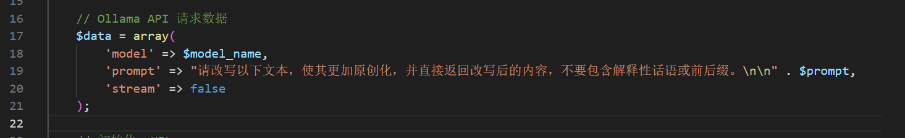

看了下论坛，关于火车头AI为原创插件的浏览量还是挺大的，说明很多朋友多有这样的需求，并且大多数的插件都是收费的，或者使用某某平台的api，每篇文章的费用也比较高，今天就自己写一份插件分享给大家。

最开始还是想要使用python写这个插件的，由于火车头/高铁需要另外配置python环境最后还是决定使用php

还是先要搭建ai环境，我使用的是ollama,很简单下载安装就好了，如果本地配置低你也可以在服务器部署ollama
https://ollama.com/
这里就不介绍了，网上有很多关于ollama的教程

我的高铁自带的php环境是5.3


修改高铁采集器中的System/PHP/php.ini文件
去掉第七行前面的';'

````
;extension=php_curl.dll
````


在/Plugins文件夹中新建文件：ollama_rewrite.php

将下面的代码写入文件：

````php
<?php
error_reporting(E_ERROR | E_WARNING | E_PARSE);

/**
 * Ollama API 相关配置
 */
$ollama_url = "http://localhost:11434/api/generate"; // Ollama API 地址（本地运行）

/**
 * 处理文本并通过 Ollama 进行改写
 */
function ollama_rewrite($prompt, $model_name)
{
    global $ollama_url;

    // Ollama API 请求数据
    $data = array(
        'model' => $model_name,
        'prompt' => "请改写以下文本，使其更加原创化，并直接返回改写后的内容，不要包含解释性话语或前后缀。\n\n" . $prompt,
        'stream' => false
    );

    // 初始化 cURL
    $ch = curl_init();
    curl_setopt($ch, CURLOPT_URL, $ollama_url);
    curl_setopt($ch, CURLOPT_RETURNTRANSFER, 1);
    curl_setopt($ch, CURLOPT_POST, 1);
    curl_setopt($ch, CURLOPT_HTTPHEADER, array('Content-Type: application/json'));
    curl_setopt($ch, CURLOPT_POSTFIELDS, json_encode($data));

    // 执行 cURL 请求
    $result = curl_exec($ch);
    if (curl_errno($ch)) {
        return "Ollama 请求失败: " . curl_error($ch);
    }
    curl_close($ch);

    // 解析返回 JSON
    $response = json_decode($result, true);
    if (!$response || !isset($response['response'])) {
        return "API 返回错误：" . $result;
    }

    return trim($response['response']); // 确保去除前后空格
}

/**
 * 采集器数据处理逻辑
 */
if ($LabelArray['PageType'] == "List") {
    $LabelArray['Html'] = '当前页面的网址为:' . $LabelUrl . "\r\n页面类型为:" . $LabelArray['PageType'] . "\r\n接收到的数据是:" . $LabelArray['Html'];
} else if ($LabelArray['PageType'] == "Content") {
    $LabelArray['Html'] = '当前页面的网址为:' . $LabelUrl . "\r\n页面类型为:" . $LabelArray['PageType'] . "\r\n接收到的数据是:" . $LabelArray['Html'];
} else if ($LabelArray['PageType'] == "Save") {

    $model_name = $LabelArray['模型'];
    // 原创化标题
    $LabelArray['标题'] = ollama_rewrite($LabelArray['标题'], $model_name);

    // 原创化内容（标题+内容）
    $LabelArray['内容'] = ollama_rewrite($LabelArray['内容'], $model_name);

    // 追加时间戳
    $LabelArray['时间'] = date('Y-m-d H:i:s', time());

    $LabelArray['模型'] = $LabelArray['模型'];
}

//############# 必须保留，保证采集器能正确获取数据 #############
echo serialize($LabelArray);
?>
````

文件下载
ollama_rewrite.php: [下载代码](https://url89.ctfile.com/f/63049189-1493974537-5218e1?p=9487 "下载代码") (访问密码: 9487)


这个模型就是你要使用的ollama模型，我这里用的是千问，你也可以使用deepseek-r1，gemma3，qwq，llama等


启用插件保存就能使用了：


如果你使用的是远程ollama，自行修改api地址


修改prompt，可以按照你制定的风格进行为原创：


如：请用接地气的风格改写一下文本，使其更加原创化，并直接返回改写后的内容，不要包含解释性话语或前后缀。
给ai加上风格，可以让内容不那么机械化，更加的有人情味。

