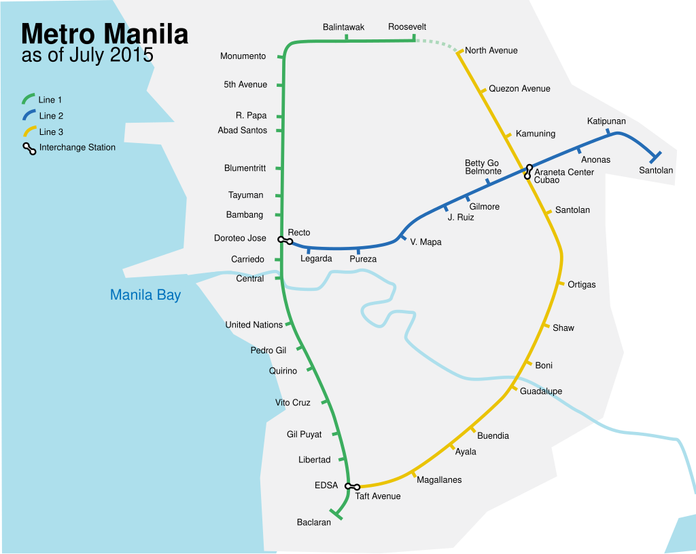

### 关于交通

在这边，如果是我一个人出行，通常会选择使用 [Grab](https://play.google.com/store/apps/details?id=com.grabtaxi.passenger&hl=zh)，主要是出于安全考虑。我其实并不常打车，一方面觉得价格偏贵，另一方面软件叫车往往需要等待比较久，也听说过一个人打车相对容易遇到风险。

乘坐吉普尼（Jeepney）的价格会便宜很多。YouTube 上有不少经验分享提到，尽量不要主动询问价格，否则可能会被要更多的钱。我一般是直接给钱，通常是 **9p**，上车后直接付，到目前为止还没有遇到过被坑的情况。

如果你不清楚吉普尼的行驶路线，可以使用 [Sakay.ph](https://play.google.com/store/apps/details?id=com.byimplication.sakay&hl=zh) 这个应用来查询。

摩托车我当时还没有乘坐过，但了解到可以通过 [Angkas](https://play.google.com/store/apps/details?id=com.angkas.passenger&hl=zh) 这个 App 来叫摩托车。

至于轻轨，我当时也还没有乘坐过。有点奇怪的是，Google Maps 上并不会清楚地显示轻轨线路，可以参考下面这张示意图。至于具体票价我当时并不清楚，如果你了解得更准确，可以在下面告诉我。

